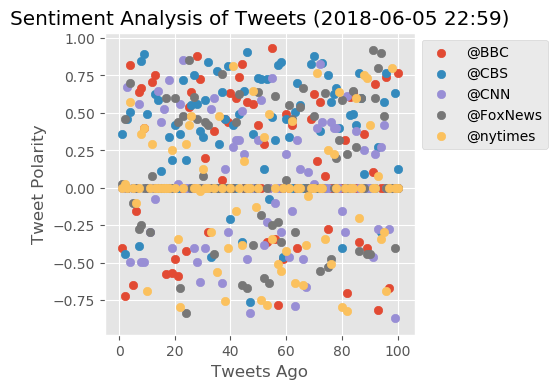

```python
# Dependencies
import tweepy
import numpy as np
import pandas as pd
from datetime import datetime
import matplotlib.pyplot as plt
from matplotlib import style
style.use('ggplot')

# Twitter API Keys
consumer_key = "INSERT KEY"
consumer_secret = "INSERT KEY"
access_token = "INSERT KEY"
access_token_secret = "INSERT KEY"

# Import and Initialize Sentiment Analyzer
from vaderSentiment.vaderSentiment import SentimentIntensityAnalyzer
analyzer = SentimentIntensityAnalyzer()

# Setup Tweepy API Authentication
auth = tweepy.OAuthHandler(consumer_key, consumer_secret)
auth.set_access_token(access_token, access_token_secret)
api = tweepy.API(auth, parser=tweepy.parsers.JSONParser())
```


```python
# Target Account
target_user = ["@BBC", "@CBS", "@CNN", "@FoxNews", "@nytimes"]

# Counter
counter = 1

# Variables for holding sentiments
sentiments = []

# Variable for max_id
oldest_tweet = None

# Loop through twitter and pull 100 tweets per news organization
for user in target_user:

    # Get all tweets from home feed
    public_tweets = api.user_timeline(user, count = 100)
    
    counter = 1

    # Loop through all tweets 
    for tweet in public_tweets:
        
        # Run Vader Analysis on each tweet
        results = analyzer.polarity_scores(tweet["text"])
        compound = results["compound"]
        pos = results["pos"]
        neu = results["neu"]
        neg = results["neg"]
        tweets_ago = counter
        
            # Get Tweet ID, subtract 1, and assign to oldest_tweet
        oldest_tweet = tweet['id'] - 1
        
            # Add sentiments for each tweet into a list
        sentiments.append({"User" : user,
                           "Date": tweet["created_at"], 
                            "Compound": compound,
                            "Positive": pos,
                            "Negative": neu,
                            "Neutral": neg,
                            "Tweets Ago": counter,
                          "Text": tweet["text"]})
        
            # Add to counter 
        counter += 1
```


```python
# Create DataFrame From Dictionary
sentiments_pd = pd.DataFrame.from_dict(sentiments)
sentiments_pd.head()
```


<div>
<style scoped>
    .dataframe tbody tr th:only-of-type {
        vertical-align: middle;
    }

    .dataframe tbody tr th {
        vertical-align: top;
    }

    .dataframe thead th {
        text-align: right;
    }
</style>
<table border="1" class="dataframe">
  <thead>
    <tr style="text-align: right;">
      <th></th>
      <th>Compound</th>
      <th>Date</th>
      <th>Negative</th>
      <th>Neutral</th>
      <th>Positive</th>
      <th>Text</th>
      <th>Tweets Ago</th>
      <th>User</th>
    </tr>
  </thead>
  <tbody>
    <tr>
      <th>0</th>
      <td>-0.4019</td>
      <td>Tue Jun 05 19:25:03 +0000 2018</td>
      <td>0.863</td>
      <td>0.137</td>
      <td>0.000</td>
      <td>'The problem with plastic is that it never goe...</td>
      <td>1</td>
      <td>@BBC</td>
    </tr>
    <tr>
      <th>1</th>
      <td>-0.7184</td>
      <td>Tue Jun 05 19:02:05 +0000 2018</td>
      <td>0.727</td>
      <td>0.273</td>
      <td>0.000</td>
      <td>#OurGirl is back and heading to Nigeria in the...</td>
      <td>2</td>
      <td>@BBC</td>
    </tr>
    <tr>
      <th>2</th>
      <td>0.0000</td>
      <td>Tue Jun 05 18:02:06 +0000 2018</td>
      <td>1.000</td>
      <td>0.000</td>
      <td>0.000</td>
      <td>👶🥦 If your child's a fussy eater, here are 5 t...</td>
      <td>3</td>
      <td>@BBC</td>
    </tr>
    <tr>
      <th>3</th>
      <td>0.8221</td>
      <td>Tue Jun 05 16:50:46 +0000 2018</td>
      <td>0.719</td>
      <td>0.000</td>
      <td>0.281</td>
      <td>RT @BBCTwo: Always wanted to pitch an idea to ...</td>
      <td>4</td>
      <td>@BBC</td>
    </tr>
    <tr>
      <th>4</th>
      <td>-0.6486</td>
      <td>Tue Jun 05 16:31:52 +0000 2018</td>
      <td>0.777</td>
      <td>0.223</td>
      <td>0.000</td>
      <td>💔 Fashion designer Kate Spade, 55, has been fo...</td>
      <td>5</td>
      <td>@BBC</td>
    </tr>
  </tbody>
</table>
</div>


```python
# Export the DataFrame to as csv 
sentiments_pd.to_csv("Twitter_News_Mood.csv", index=False)
```


```python
# Create plot
plt.figure(figsize=(4,4), dpi=100)
# Plot Scatterplot Using a For Loop.
for user in target_user:
    dataframe = sentiments_pd.loc[sentiments_pd["User"] == user]
    plt.scatter(dataframe["Tweets Ago"],dataframe["Compound"],label = user)
    
    plt.legend(bbox_to_anchor = (1,1))

# Incorporate the other graph properties
now = datetime.now()
now = now.strftime("%Y-%m-%d %H:%M")
plt.title(f"Sentiment Analysis of Tweets ({now})")
# plt.xlim(101, -1)
plt.ylabel("Tweet Polarity")
plt.xlabel("Tweets Ago")
lgd = plt.legend(bbox_to_anchor = (1,1))

# Save Graph as PNG
plt.savefig("Sentiment_Analysis_Of_Tweets.png", bbox_extra_artists=(lgd,), bbox_inches='tight')

plt.show()
```





```python
# Find Averages
average_sentiment = sentiments_pd.groupby("User")["Compound"].mean()
average_sentiment
```


    User
    @BBC        0.104977
    @CBS        0.315567
    @CNN        0.031320
    @FoxNews    0.088640
    @nytimes   -0.018138
    Name: Compound, dtype: float64


```python
# Graph
x_axis = np.arange(len(average_sentiment))
xlabels = average_sentiment.index
count = 0
for sentiment in average_sentiment:
    plt.text(count, sentiment+.01, str(round(sentiment,2)))
    count = count + 1
plt.bar(x_axis, average_sentiment, tick_label = xlabels, color = ['silver', 'b', 'y', 'g', 'c'])

# Set title, x axis label, and y axis label.
now = datetime.now()
now = now.strftime("%Y-%m-%d %H:%M")
plt.title(f"Overall Sentiment of Media Tweets ({now})")
plt.xlabel("News Organizations")
plt.ylabel("Tweet Polarity")
plt.savefig("Overall Sentiment of Media Tweets")

# Save Graph as PNG
plt.savefig("Overall_Sentiment_Of_Media_Tweets.png")

plt.show()
```


